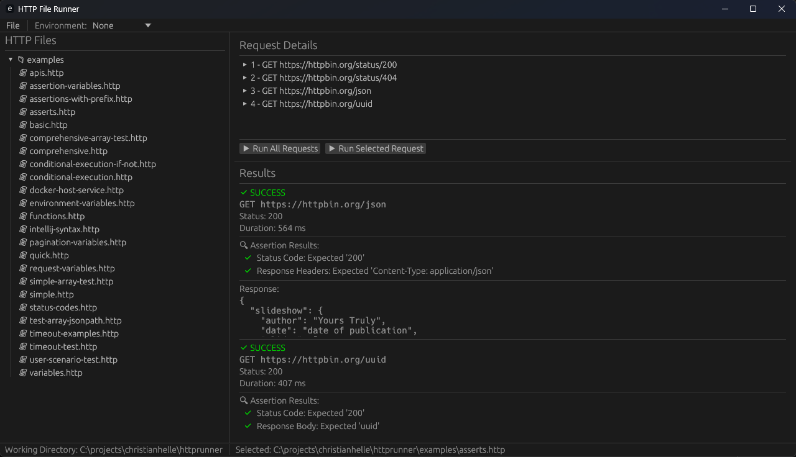

# HTTP File Runner

[](https://github.com/christianhelle/httprunner/actions/workflows/build-linux.yml)
[](https://github.com/christianhelle/httprunner/actions/workflows/build-macos.yml)
[](https://github.com/christianhelle/httprunner/actions/workflows/build-windows.yml)
[](https://codecov.io/gh/christianhelle/httprunner)
[](https://www.rust-lang.org/)
[](https://opensource.org/licenses/MIT)

A powerful command-line tool, Terminal UI (TUI), and GUI application (Native as WASM) written in Rust that parses `.http` files and executes HTTP requests, providing colored output with emojis to indicate success or failure.

## Features

- 🚀 Parse and execute HTTP requests from `.http` files
- 📁 Support for multiple `.http` files in a single run
- 🔍 `--discover` mode to recursively find and run all `.http` files
- 📝 `--verbose` mode for detailed request and response information
- 🎨 `--pretty-json` flag to format JSON payloads in verbose output for improved readability
- 📋 `--log` mode to save all output to a file for analysis and reporting
- 📊 `--report` flag to generate summary reports in markdown or html format for test results
- 💾 `--export` flag to save individual HTTP requests and responses to timestamped log files
- ✅ Color-coded output (green for success, red for failure, yellow for skipped)
- 📊 Summary statistics showing passed/failed/skipped counts (per file and overall)
- 🌐 Support for various HTTP methods (GET, POST, PUT, DELETE, PATCH)
- ⏱️ **Request delay** for rate limiting compliance:
  - Global `--delay` flag (CLI) and UI controls (TUI/GUI) for delays between consecutive requests
  - Per-request `@pre-delay` and `@post-delay` keywords in .http files
- 📝 **Custom headers support** with full request header implementation
- 🎯 Detailed error reporting with status codes
- 🛡️ Robust error handling for network issues
- 🔒 **Insecure HTTPS support** with `--insecure` flag for development environments
- 🔍 **Response assertions** for status codes, body content, and headers
- 🔧 **Variables support** with substitution in URLs, headers, and request bodies
- 🔧 **Request Variables** for chaining requests and passing data between HTTP calls
- 🎲 **Built-in functions** for dynamic value generation (`guid()`, `string()`, `number()`, `base64_encode()`, `upper()`, `lower()`, `name()`, `first_name()`, `last_name()`, `address()`, `email()`, `getdate()`, `gettime()`, `getdatetime()`, `getutcdatetime()`)
- 🔀 **Conditional Execution** with `@dependsOn` and `@if` directives for request dependencies
- ⏱️ **Customizable timeouts** for connection and read operations with flexible time units
- 📋 **Semantic versioning** with git tag and commit information
- 🔍 **Build-time version generation** with automatic git integration

## Version Information

The application includes comprehensive version information accessible via:

```bash
httprunner --version
# or
httprunner -v
```

This displays:

- Application version (semantic versioning)
- Git tag information
- Git commit hash
- Build timestamp

The version information is automatically generated at build time using git repository data.

## Installation

### Option 1: Quick Install Script (Recommended)

**Linux/macOS:**

```bash
curl -fsSL https://christianhelle.com/httprunner/install | bash
```

**Windows (PowerShell):**

```powershell
irm https://christianhelle.com/httprunner/install.ps1 | iex
```

The install scripts will:

- Automatically detect your platform and architecture
- Download the latest release from GitHub
- Install the binary to an appropriate location
- Add it to your PATH (if desired)

**Custom installation directory:**

```bash
# Linux/macOS
INSTALL_DIR=$HOME/.local/bin curl -fsSL https://christianhelle.com/httprunner/install | bash

# Windows
irm https://christianhelle.com/httprunner/install.ps1 | iex -InstallDir "C:\Tools"
```

### Option 2: Manual Download

Download the latest release for your platform from the [GitHub Releases page](https://github.com/christianhelle/httprunner/releases/latest):

- **Linux x86_64:** `httprunner-linux-x86_64.tar.gz`
- **macOS x86_64:** `httprunner-macos-x86_64.tar.gz`
- **macOS ARM64:** `httprunner-macos-aarch64.tar.gz`
- **Windows x86_64:** `httprunner-windows-x86_64.zip`

Extract the archive and add the binary to your PATH.

### Option 3: Install from Crates.io

If you have Rust tooling installed, you can install httprunner directly from Crates.io:

```bash
cargo install httprunner
```

This will download, compile, and install the latest version of httprunner. The binary will be installed to `~/.cargo/bin/` (or `%USERPROFILE%\.cargo\bin\` on Windows), which should already be in your PATH if you installed Rust via rustup.

### Option 4: Install from Snap Store

```bash
sudo snap install httprunner
```

### Option 5: Build from Source

Make sure you have Rust installed (version 1.92 or later).

#### CLI Version

```bash
git clone https://github.com/christianhelle/httprunner.git
cd httprunner
cargo build --release -p httprunner
```

The binary will be at `target/release/httprunner` (or `httprunner.exe` on Windows).

#### GUI Version

The GUI version requires additional system dependencies on Linux. See [GUI README](src/gui/src/README.md) for details.

```bash
git clone https://github.com/christianhelle/httprunner.git
cd httprunner

# Linux: Install dependencies first
# Ubuntu/Debian:
sudo apt-get install libxcb-render0-dev libxcb-shape0-dev libxcb-xfixes0-dev \
    libxkbcommon-dev libwayland-dev

# Build GUI (all platforms)
cargo build --release -p httprunner-gui
```

The GUI binary will be at `target/release/httprunner-gui` (or `httprunner-gui.exe` on Windows).

**Note**: macOS and Windows don't require additional dependencies for the GUI.

#### Build Both (Default)

To build both CLI and GUI in one command:

```bash
cargo build --release
```

This builds both binaries at once.

### Option 6: Use Docker

The httprunner is available as a Docker image on Docker Hub at `christianhelle/httprunner`.

```bash
# Pull the latest image
docker pull christianhelle/httprunner
```

The httprunner-tui is also available as a separate Docker image at `christianhelle/httprunner-tui`.

```bash
# Pull the latest TUI image
docker pull christianhelle/httprunner-tui
```

## Upgrading

### Quick Upgrade

If you have httprunner already installed, you can easily upgrade to the latest version using the built-in upgrade command:

```bash
# Upgrade to the latest version
httprunner --upgrade
```

The upgrade command will:

- Automatically detect your platform (Windows, Linux, macOS)
- Download and run the appropriate install script
- Update httprunner to the latest version available
- Preserve your existing installation location

**What it runs under the hood:**

- **Linux/macOS:** `curl -fsSL https://christianhelle.com/httprunner/install | bash`
- **Windows:** `irm https://christianhelle.com/httprunner/install.ps1 | iex`

After upgrading, you may need to restart your terminal to use the updated version.

### Manual Upgrade

Alternatively, you can always re-run the installation scripts manually:

**Linux/macOS:**

```bash
curl -fsSL https://christianhelle.com/httprunner/install | bash
```

**Windows (PowerShell):**

```powershell
irm https://christianhelle.com/httprunner/install.ps1 | iex
```

## Usage

### If installed via install script, crates.io, or snap

```bash
# Run a single .http file
httprunner <http-file>

# Run a single .http file with verbose output
httprunner <http-file> --verbose

# Run a single .http file with verbose output and pretty-printed JSON
httprunner <http-file> --verbose --pretty-json

# Run a single .http file with a 500ms delay between requests
httprunner <http-file> --delay 500

# Run a single .http file with insecure HTTPS (accept invalid certificates)
httprunner <http-file> --insecure

# Run a single .http file and save output to a log file
httprunner <http-file> --log

# Run a single .http file with verbose output and save to a custom log file
httprunner <http-file> --verbose --log results.txt

# Run and generate a summary report (defaults to markdown)
httprunner <http-file> --report

# Run and generate an HTML summary report
httprunner <http-file> --report html

# Run and generate a markdown summary report (explicit)
httprunner <http-file> --report markdown

# Export requests and responses to individual timestamped files
httprunner <http-file> --export

# Export with verbose output and pretty-printed JSON
httprunner <http-file> --verbose --pretty-json --export

# Combine export with report generation
httprunner <http-file> --export --report html

# Run without the donation banner
httprunner <http-file> --no-banner

# Run multiple .http files
httprunner <http-file1> <http-file2> [...]

# Run multiple .http files and log output
httprunner <http-file1> <http-file2> [...] --log execution.log

# Discover and run all .http files recursively
httprunner --discover

# Discover and run all .http files with verbose output
httprunner --discover --verbose

# Discover and run all .http files and save output to log
httprunner --discover --log discovery.log

# Discover and run all .http files with verbose output and logging
httprunner --discover --verbose --log detailed_results.txt
```

### If built from source

#### Windows PowerShell Users

For proper emoji display in PowerShell, set UTF-8 encoding:

```pwsh
[Console]::OutputEncoding = [System.Text.Encoding]::UTF8
.\target\release\httprunner.exe <http-file>

# Run with verbose output
.\target\release\httprunner.exe <http-file> --verbose

# Run with insecure HTTPS (accept invalid certificates)
.\target\release\httprunner.exe <http-file> --insecure

# Run and save output to a log file
.\target\release\httprunner.exe <http-file> --log

# Run with verbose output and save to a custom log file
.\target\release\httprunner.exe <http-file> --verbose --log results.txt

# Run and generate a summary report (defaults to markdown)
.\target\release\httprunner.exe <http-file> --report

# Run and generate an HTML summary report
.\target\release\httprunner.exe <http-file> --report html

# Run and generate a markdown summary report (explicit)
.\target\release\httprunner.exe <http-file> --report markdown

# Export requests and responses to individual timestamped files
.\target\release\httprunner.exe <http-file> --export

# Export with verbose output and pretty-printed JSON
.\target\release\httprunner.exe <http-file> --verbose --pretty-json --export

# Combine export with report generation
.\target\release\httprunner.exe <http-file> --export --report html

# Run without the donation banner
.\target\release\httprunner.exe <http-file> --no-banner

# Run multiple files
.\target\release\httprunner.exe examples\simple.http examples\basic.http

# Run multiple files and log output
.\target\release\httprunner.exe examples\simple.http examples\basic.http --log execution.log

# Discover all .http files
.\target\release\httprunner.exe --discover

# Discover all .http files with verbose output
.\target\release\httprunner.exe --discover --verbose

# Discover all .http files and save output to log
.\target\release\httprunner.exe --discover --log discovery.log

# Discover all .http files with verbose output and logging
.\target\release\httprunner.exe --discover --verbose --log detailed_results.txt
```

### Command Line

```bash
# Run a single .http file
./target/release/httprunner <http-file>

# Run a single .http file with verbose output
./target/release/httprunner <http-file> --verbose

# Run a single .http file with verbose output and pretty-printed JSON
./target/release/httprunner <http-file> --verbose --pretty-json

# Run a single .http file and save output to a log file
./target/release/httprunner <http-file> --log

# Run a single .http file with verbose output and save to a custom log file
./target/release/httprunner <http-file> --verbose --log results.txt

# Run and generate a summary report (defaults to markdown)
./target/release/httprunner <http-file> --report

# Run and generate an HTML summary report
./target/release/httprunner <http-file> --report html

# Run and generate a markdown summary report (explicit)
./target/release/httprunner <http-file> --report markdown

# Export requests and responses to individual timestamped files
./target/release/httprunner <http-file> --export

# Export with verbose output and pretty-printed JSON
./target/release/httprunner <http-file> --verbose --pretty-json --export

# Combine export with report generation
./target/release/httprunner <http-file> --export --report html

# Run without the donation banner
./target/release/httprunner <http-file> --no-banner

# Run multiple .http files
./target/release/httprunner <http-file1> <http-file2> [...]

# Run multiple .http files and log output
./target/release/httprunner <http-file1> <http-file2> [...] --log execution.log

# Discover and run all .http files recursively from current directory
./target/release/httprunner --discover

# Discover and run all .http files with verbose output
./target/release/httprunner --discover --verbose

# Discover and run all .http files and save output to log
./target/release/httprunner --discover --log discovery.log

# Discover and run all .http files with verbose output and logging
./target/release/httprunner --discover --verbose --log detailed_results.txt
```

### Examples

```bash
# Test basic functionality
./target/release/httprunner examples/simple.http

# Test basic functionality with verbose output
./target/release/httprunner examples/simple.http --verbose

# Test basic functionality with verbose output and pretty-printed JSON
./target/release/httprunner examples/simple.http --verbose --pretty-json

# Test basic functionality and save output to log
./target/release/httprunner examples/simple.http --log

# Test basic functionality with verbose output and custom log file
./target/release/httprunner examples/simple.http --verbose --log simple_test.log

# Test basic functionality and generate markdown report
./target/release/httprunner examples/simple.http --report

# Test basic functionality and generate HTML report
./target/release/httprunner examples/simple.http --report html

# Test various APIs
./target/release/httprunner examples/apis.http

# Test various APIs and log results
./target/release/httprunner examples/apis.http --log api_test.log

# Test different HTTP status codes
./target/release/httprunner examples/status-codes.http

# Test different HTTP status codes with verbose logging
./target/release/httprunner examples/status-codes.http --verbose --log status_test.log

# Test basic GET requests
./target/release/httprunner examples/basic.http

# Run multiple files at once
./target/release/httprunner examples/simple.http examples/quick.http

# Run multiple files with verbose output
./target/release/httprunner examples/simple.http examples/quick.http --verbose

# Run multiple files and log output
./target/release/httprunner examples/simple.http examples/quick.http --log multi_test.log

# Run multiple files with verbose output and logging
./target/release/httprunner examples/simple.http examples/quick.http --verbose --log detailed_multi_test.log

# Discover and run all .http files in the project
./target/release/httprunner --discover

# Discover and run all .http files with verbose output
./target/release/httprunner --discover --verbose

# Discover and run all .http files and save output to log
./target/release/httprunner --discover --log discovery.log

# Discover and run all .http files with verbose output and logging
./target/release/httprunner --discover --verbose --log full_discovery.log

# Run all files in a specific directory (using shell globbing)
./target/release/httprunner examples/*.http

# Run all files in a specific directory and log output
./target/release/httprunner examples/*.http --log examples_test.log
```

### If using Docker

```bash
# Run with a single .http file (mount current directory)
docker run -it --mount "type=bind,source=${PWD},target=/app,readonly" christianhelle/httprunner <http-file>

# Run with a single .http file with verbose output
docker run -it --mount "type=bind,source=${PWD},target=/app,readonly" christianhelle/httprunner <http-file> --verbose

# Run with a single .http file with verbose output and pretty-printed JSON
docker run -it --mount "type=bind,source=${PWD},target=/app,readonly" christianhelle/httprunner <http-file> --verbose --pretty-json

# Run with insecure HTTPS (accept invalid certificates)
docker run -it --mount "type=bind,source=${PWD},target=/app,readonly" christianhelle/httprunner <http-file> --insecure

# Run with a single .http file and save output to log
docker run -it --mount "type=bind,source=${PWD},target=/app,readonly" christianhelle/httprunner <http-file> --log

# Run with a single .http file with verbose output and custom log file
docker run -it --mount "type=bind,source=${PWD},target=/app,readonly" christianhelle/httprunner <http-file> --verbose --log results.txt

# Run and generate a summary report (defaults to markdown)
docker run -it --mount "type=bind,source=${PWD},target=/app,readonly" christianhelle/httprunner <http-file> --report

# Run and generate an HTML summary report
docker run -it --mount "type=bind,source=${PWD},target=/app,readonly" christianhelle/httprunner <http-file> --report html

# Run and generate a markdown summary report (explicit)
docker run -it --mount "type=bind,source=${PWD},target=/app,readonly" christianhelle/httprunner <http-file> --report markdown

# Export requests and responses to individual timestamped files
docker run -it --mount "type=bind,source=${PWD},target=/app,readonly" christianhelle/httprunner <http-file> --export

# Export with verbose output and pretty-printed JSON
docker run -it --mount "type=bind,source=${PWD},target=/app,readonly" christianhelle/httprunner <http-file> --verbose --pretty-json --export

# Combine export with report generation
docker run -it --mount "type=bind,source=${PWD},target=/app,readonly" christianhelle/httprunner <http-file> --export --report html

# Run multiple .http files
docker run -it --mount "type=bind,source=${PWD},target=/app,readonly" christianhelle/httprunner <http-file1> <http-file2>

# Run multiple .http files and log output
docker run -it --mount "type=bind,source=${PWD},target=/app,readonly" christianhelle/httprunner <http-file1> <http-file2> --log execution.log

# Discover and run all .http files in current directory
docker run -it --mount "type=bind,source=${PWD},target=/app,readonly" christianhelle/httprunner --discover

# Discover and run all .http files with verbose output
docker run -it --mount "type=bind,source=${PWD},target=/app,readonly" christianhelle/httprunner --discover --verbose

# Discover and run all .http files and save output to log
docker run -it --mount "type=bind,source=${PWD},target=/app,readonly" christianhelle/httprunner --discover --log discovery.log

# Discover and run all .http files with verbose output and logging
docker run -it --mount "type=bind,source=${PWD},target=/app,readonly" christianhelle/httprunner --discover --verbose --log full_discovery.log

# Alternative: Create an alias for easier usage
alias httprunner='docker run -it --mount "type=bind,source=${PWD},target=/app,readonly" christianhelle/httprunner'
httprunner --discover
httprunner examples/simple.http --verbose
httprunner examples/simple.http --verbose --pretty-json
httprunner examples/simple.http --log test.log
httprunner examples/simple.http --verbose --log detailed_test.log
httprunner examples/simple.http --report
httprunner examples/simple.http
```

### If using Docker with TUI

The TUI (Terminal User Interface) is also available as a Docker image. Note that the TUI requires an interactive terminal:

```bash
# Run the TUI (requires interactive terminal with -it flags)
docker run -it --mount "type=bind,source=${PWD},target=/app,readonly" christianhelle/httprunner-tui

# Alternative: Create an alias for the TUI
alias httprunner-tui='docker run -it --mount "type=bind,source=${PWD},target=/app,readonly" christianhelle/httprunner-tui'
httprunner-tui
```

**Note**: The TUI Docker image requires the `-it` flags to provide an interactive terminal. Without these flags, the TUI will not be able to render properly.

**Note**: The Docker container mounts your current directory as `/app` in read-only mode to access your `.http` files. Make sure your `.http` files are in the current directory or subdirectories.

### Docker Networking: Accessing Host Services

When running httprunner in a Docker container, there's an important networking consideration: **`localhost` inside the container refers to the container itself, not your host machine**. If you need to test services running on your host machine, you'll need to use special hostnames or network configurations.

#### The Problem

```http
# This will fail when run from a Docker container
# It tries to connect to the container's localhost, not the host
GET http://localhost:8080/api/users
```

If you have a service running on your host machine at `http://localhost:8080`, this request will fail with a connection refused error when executed from inside the container.

#### Solutions by Platform

**macOS and Windows (Docker Desktop):**

Use `host.docker.internal` to refer to the host machine:

```http
# This works on macOS and Windows with Docker Desktop
GET http://host.docker.internal:8080/api/users
```

```bash
# Run the .http file with host.docker.internal
docker run -it --mount "type=bind,source=${PWD},target=/app,readonly" christianhelle/httprunner test.http
```

**Linux:**

Linux requires additional network configuration. You have several options:

**Option 1: Use host networking mode (simplest)**

```bash
# Run with --network=host to use the host's network stack
docker run -it --network=host \
  --mount "type=bind,source=${PWD},target=/app,readonly" \
  christianhelle/httprunner test.http
```

With host networking, `localhost` in your `.http` files will correctly refer to the host machine.

**Option 2: Use host gateway (Docker 20.10+)**

```bash
# Add host.docker.internal on Linux
docker run -it --add-host=host.docker.internal:host-gateway \
  --mount "type=bind,source=${PWD},target=/app,readonly" \
  christianhelle/httprunner test.http
```

Then use `host.docker.internal` in your `.http` files:

```http
GET http://host.docker.internal:8080/api/users
```

**Option 3: Use the host's IP address**

Find your host's IP address (e.g., `192.168.1.100`) and use it directly:

```http
GET http://192.168.1.100:8080/api/users
```

#### Recommended Approach

For cross-platform compatibility, we recommend:

1. **Use environment variables** in your `.http` files:

```http
# In your .http file
@hostname=localhost

GET http://{{hostname}}:8080/api/users
```

2. **Create an environment file** (`http-client.env.json`):

```json
{
  "local": {
    "hostname": "localhost"
  },
  "docker": {
    "hostname": "host.docker.internal"
  }
}
```

3. **Run with the appropriate environment**:

```bash
# On host machine
httprunner test.http --env local

# In Docker on macOS/Windows
docker run -it --mount "type=bind,source=${PWD},target=/app,readonly" \
  christianhelle/httprunner test.http --env docker

# In Docker on Linux (with host gateway)
docker run -it --add-host=host.docker.internal:host-gateway \
  --mount "type=bind,source=${PWD},target=/app,readonly" \
  christianhelle/httprunner test.http --env docker
```

#### Quick Reference

| Scenario | Solution |
|----------|----------|
| macOS/Windows Docker Desktop | Use `host.docker.internal` |
| Linux Docker (simplest) | Use `--network=host` flag |
| Linux Docker (isolated) | Use `--add-host=host.docker.internal:host-gateway` |
| Cross-platform | Use environment variables with different configs |

For more details on Docker networking, see the [Docker networking documentation](https://docs.docker.com/network/).

## Insecure HTTPS

By default, httprunner validates SSL/TLS certificates and hostnames for secure HTTPS connections. For development environments with self-signed certificates or testing scenarios, you can use the `--insecure` flag to bypass certificate validation.

### Using the --insecure Flag

```bash
# Accept self-signed certificates
httprunner https-endpoints.http --insecure

# Combine with other flags
httprunner https-endpoints.http --insecure --verbose
httprunner https-endpoints.http --insecure --log test.log
```

### What --insecure Does

When the `--insecure` flag is enabled:
- ✅ Accepts invalid SSL/TLS certificates
- ✅ Accepts invalid hostnames
- ✅ Allows connections to servers with self-signed certificates
- ⚠️ **Warning**: Only use in development/testing environments

### Example

```http
# This will fail without --insecure if the certificate is self-signed
GET https://localhost:44320/api/users
Authorization: Bearer {{token}}
```

Run with:
```bash
httprunner api-test.http --insecure
```

**Security Note**: The `--insecure` flag should **only** be used in development and testing environments. Never use it in production as it disables important security checks that protect against man-in-the-middle attacks.

## Request Delay

The HTTP File Runner supports adding delays between consecutive HTTP requests. This is useful for:
- **Rate limiting compliance**: Respect API rate limits by spacing requests
- **Load testing**: Simulate realistic user behavior with delays
- **Server protection**: Avoid overwhelming servers with rapid requests
- **Debugging**: Slow down execution to observe behavior

### CLI Usage

Use the `--delay` flag to specify delay in milliseconds:

```bash
# Add 500ms delay between requests
httprunner examples/multiple-requests.http --delay 500

# Add 1 second delay between requests
httprunner examples/api-chain.http --delay 1000

# Combine with other flags
httprunner examples/api-test.http --delay 250 --verbose
httprunner --discover --delay 500 --log results.txt
```

### TUI Usage

In the Terminal UI application:
- Press `]` to increase delay by 100ms (max 10 seconds)
- Press `[` to decrease delay by 100ms (min 0ms)
- Current delay is displayed in the status bar

### GUI Usage

In the GUI application:
1. Open the **Settings** menu
2. Adjust the **Request Delay (ms)** slider (0-10,000ms range)
3. The setting is automatically saved and persists between sessions

### Notes

- Delay is applied **between** consecutive requests (not before the first request)
- Default delay is 0ms (no delay)
- When running a single request file with only one request, no delay is applied
- The delay setting persists in TUI and GUI applications

### Per-Request Delays

You can also specify delays for individual requests using the `@pre-delay` and `@post-delay` keywords in your `.http` files:

```http
# @pre-delay waits before executing the request
# @name delayedRequest
# @pre-delay 1000
GET https://api.example.com/rate-limited

###

# @post-delay waits after the request completes
# @name slowRequest
# @post-delay 2000
POST https://api.example.com/submit
Content-Type: application/json

{"data": "value"}

###

# Combine both pre and post delays
# @name combinedDelay
# @pre-delay 500
# @post-delay 500
GET https://api.example.com/resource
```

**Per-request delay keywords:**
- `@pre-delay <milliseconds>` - Delay before executing the request
- `@post-delay <milliseconds>` - Delay after the request completes
- Values are in milliseconds
- Can be combined with other directives (`@name`, `@timeout`, `@dependsOn`, etc.)
- Per-request delays are independent of the global `--delay` CLI flag

## Suppressing the Donation Banner

By default, httprunner displays a donation banner encouraging users to support the project. If you prefer to run without this banner (useful in CI/CD environments or scripts), use the `--no-banner` flag:

```bash
# Run without the donation banner
httprunner examples/simple.http --no-banner

# Works with all other flags
httprunner examples/simple.http --no-banner --verbose
httprunner --discover --no-banner --log results.txt
```

This is particularly useful in:
- **Automated scripts**: Keep output clean in scripts and CI/CD pipelines
- **Log files**: Reduce banner noise in logged output
- **User preference**: Suppress the banner if you're not interested in support options

## Telemetry

httprunner collects anonymous telemetry data to help improve the application. This data helps us understand how the tool is used and identify issues.

### What We Collect

- **Application events**: Startup, shutdown, and errors (sanitized to remove sensitive information)
- **CLI flags used**: Which command-line options are popular (e.g., `--verbose`, `--discover`)
- **Execution statistics**: Success/failure counts and duration (no request/response content)
- **System information**: OS type, architecture, app version

### What We DON'T Collect

- ❌ **HTTP request/response content** (URLs, headers, bodies)
- ❌ **File paths** or file names
- ❌ **Environment variable values**
- ❌ **Personal identifiable information (PII)**
- ❌ **IP addresses, email addresses, or hostnames from your requests**

All error messages are sanitized to remove file paths, URLs, IP addresses, and email addresses before being sent.

### Opting Out

You can disable telemetry using any of these methods:

**CLI flag:**
```bash
httprunner --no-telemetry examples/simple.http
```

**Environment variables:**
```bash
# httprunner-specific opt-out
export HTTPRUNNER_TELEMETRY_OPTOUT=1

# Standard Do Not Track (works with many tools)
export DO_NOT_TRACK=1
```

The telemetry preference is respected across CLI, TUI, and GUI applications.

## .http File Format

The HTTP File Runner supports a simple format for defining HTTP requests:

```http
# Comments start with #

# Basic GET request
GET https://api.github.com/users/octocat

# Request with headers
GET https://httpbin.org/headers
User-Agent: HttpRunner/1.0
Accept: application/json

# POST request with body
POST https://httpbin.org/post
Content-Type: application/json

{
  "name": "test",
  "value": 123
}
```

## Built-in Functions

The HTTP File Runner provides built-in functions for dynamic value generation in your `.http` files. Functions are case-insensitive and automatically generate values when the request is executed.

### Available Functions

#### `guid()` - Generate UUID
Generates a new UUID v4 (Universally Unique Identifier) in simple format (32 hex characters without dashes).

```http
POST https://api.example.com/users
Content-Type: application/json

{
  "id": "guid()",
  "requestId": "GUID()"
}
```

#### `string()` - Generate Random String
Generates a random alphanumeric string of 20 characters.

```http
POST https://api.example.com/test
Content-Type: application/json

{
  "sessionKey": "string()",
  "token": "STRING()"
}
```

#### `number()` - Generate Random Number
Generates a random number between 0 and 100 (inclusive).

```http
POST https://api.example.com/data
Content-Type: application/json

{
  "randomValue": "number()",
  "percentage": "NUMBER()"
}
```

#### `base64_encode()` - Base64 Encoding
Encodes a string to Base64 format. The string must be enclosed in single quotes.

```http
POST https://api.example.com/auth
Content-Type: application/json

{
  "credentials": "base64_encode('username:password')",
  "token": "BASE64_ENCODE('Hello, World!')"
}
```

#### `upper()` - Convert to Uppercase
Converts a string to uppercase. The string must be enclosed in single quotes.

```http
POST https://api.example.com/data
Content-Type: application/json

{
  "code": "upper('hello, world')",
  "shout": "UPPER('quiet text')"
}
```

#### `lower()` - Convert to Lowercase
Converts a string to lowercase. The string must be enclosed in single quotes.

```http
POST https://api.example.com/data
Content-Type: application/json

{
  "normalized": "lower('HELLO, WORLD')",
  "lowercase": "LOWER('Mixed Case Text')"
}
```

#### `name()` - Generate Full Name
Generates a random full name (first name + last name).

```http
POST https://api.example.com/users
Content-Type: application/json

{
  "fullName": "name()",
  "displayName": "NAME()"
}
```

#### `first_name()` - Generate First Name
Generates a random first name.

```http
POST https://api.example.com/users
Content-Type: application/json

{
  "firstName": "first_name()",
  "givenName": "FIRST_NAME()"
}
```

#### `last_name()` - Generate Last Name
Generates a random last name.

```http
POST https://api.example.com/users
Content-Type: application/json

{
  "lastName": "last_name()",
  "surname": "LAST_NAME()"
}
```

#### `address()` - Generate Address
Generates a random full mailing address (street, city, postal code, country).

```http
POST https://api.example.com/users
Content-Type: application/json

{
  "streetAddress": "address()",
  "mailingAddress": "ADDRESS()"
}
```

#### `email()` - Generate Email Address
Generates a random email address in the format firstname.lastname@domain.com.

```http
POST https://api.example.com/users
Content-Type: application/json

{
  "email": "email()",
  "contactEmail": "EMAIL()"
}
```

#### `job_title()` - Generate Job Title
Generates a random job title.

```http
POST https://api.example.com/users
Content-Type: application/json

{
  "title": "job_title()",
  "position": "JOB_TITLE()"
}
```

#### `getdate()` - Get Current Date
Returns the current local date in `YYYY-MM-DD` format.

```http
POST https://api.example.com/events
Content-Type: application/json

{
  "eventDate": "getdate()",
  "createdDate": "GETDATE()"
}
```

#### `gettime()` - Get Current Time
Returns the current local time in `HH:MM:SS` format (24-hour).

```http
POST https://api.example.com/logs
Content-Type: application/json

{
  "timestamp": "gettime()",
  "logTime": "GETTIME()"
}
```

#### `getdatetime()` - Get Current Date and Time
Returns the current local date and time in `YYYY-MM-DD HH:MM:SS` format.

```http
POST https://api.example.com/records
Content-Type: application/json

{
  "createdAt": "getdatetime()",
  "timestamp": "GETDATETIME()"
}
```

#### `getutcdatetime()` - Get Current UTC Date and Time
Returns the current UTC date and time in `YYYY-MM-DD HH:MM:SS` format.

```http
POST https://api.example.com/records
Content-Type: application/json

{
  "utcTimestamp": "getutcdatetime()",
  "serverTime": "GETUTCDATETIME()"
}
```

### Function Features

- ✅ **Case-insensitive**: `guid()`, `GUID()`, and `Guid()` all work identically
- ✅ **Dynamic generation**: Values are generated fresh for each request execution
- ✅ **Works everywhere**: Use in URLs, headers, and request bodies
- ✅ **Combine with variables**: Functions can be used alongside variables

### Example Usage

See `examples/functions.http` for a complete demonstration:

```http
POST https://httpbin.org/post
Content-Type: application/json

{
  "guid": "guid()",
  "GUID": "GUID()",
  "string": "string()",
  "STRING": "STRING()",
  "number": "number()",
  "NUMBER": "NUMBER()",
  "to_base64": "base64_encode('Hello, World!')",
  "TO_BASE64": "BASE64_ENCODE('Hello, World!')",
  "upper": "upper('hello, world')",
  "lower": "lower('HELLO, WORLD')",
  "first_name": "first_name()",
  "last_name": "last_name()",
  "name": "name()",
  "address": "address()",
  "email": "email()"
}
```

## Variables

The HTTP File Runner supports variables to make your .http files more flexible and reusable. Variables are defined using the `@` syntax and can be referenced using double curly braces `{{variable_name}}`.

### Variable Definition

Variables are defined at the beginning of a line with the syntax `@VariableName=Value`:

```http
@hostname=localhost
@port=8080
@protocol=https
```

### Variable Usage

Variables can be referenced in URLs, headers, and request bodies using double curly braces:

```http
@hostname=localhost
@port=44320
GET https://{{hostname}}:{{port}}/

# Request with variable in headers
GET https://{{hostname}}:{{port}}/api/users
Authorization: Bearer {{token}}

# Request with variables in body
POST https://{{hostname}}:{{port}}/api/users
Content-Type: application/json

{
  "host": "{{hostname}}",
  "endpoint": "https://{{hostname}}:{{port}}/profile"
}
```

### Variable Composition

Variables can be defined using values of other variables that were defined earlier in the file:

```http
@hostname=localhost
@port=44320
@host={{hostname}}:{{port}}
@baseUrl=https://{{host}}

GET {{baseUrl}}/api/search/tool
```

**Note:** Variables must be defined before they can be used. The order of definition matters.

## Environment Files

To give variables different values in different environments, create a file named `http-client.env.json`. This file should be located in the same directory as the `.http` file or in one of its parent directories.

### Environment File Format

The environment file is a JSON file that contains one or more named environments. Here's an example:

```json
{
  "dev": {
    "HostAddress": "https://localhost:44320",
    "ApiKey": "dev-api-key-123",
    "Environment": "development"
  },
  "staging": {
    "HostAddress": "https://staging.contoso.com",
    "ApiKey": "staging-api-key-456",
    "Environment": "staging"
  },
  "prod": {
    "HostAddress": "https://contoso.com",
    "ApiKey": "prod-api-key-789", 
    "Environment": "production"
  }
}
```

### Using Environment Variables

Variables from an environment file are referenced the same way as other variables:

```http
# This will use the HostAddress from the specified environment
GET {{HostAddress}}/api/search/tool
Authorization: Bearer {{ApiKey}}
X-Environment: {{Environment}}
```

### Specifying Environment

Use the `--env` flag to specify which environment to use:

```bash
# Use development environment
httprunner myfile.http --env dev

# Use production environment  
httprunner myfile.http --env prod
```

### Variable Override Behavior

If a variable is defined in both the `.http` file and the environment file:

- **Environment variables** are loaded first
- **Variables in .http file** override environment variables with the same name
- This allows you to have environment defaults while still being able to override them per request file

## Request Variables

Request Variables allow you to chain HTTP requests by passing data from one request to another within the same `.http` file. This feature enables powerful workflows like authentication flows, data extraction, and response chaining.

### Request Variable Syntax

The syntax for request variables follows this pattern:

```text
{{<request_name>.(request|response).(body|headers).(*|JSONPath|XPath|<header_name>)}}
```

Where:

- `request_name`: The name of a previous request (defined with `# @name`)
- `request|response`: Whether to extract from the request or response
- `body|headers`: Whether to extract from body or headers  
- `*|JSONPath|XPath|header_name`: The extraction path

### Authentication Flow Example

```http
# @name authenticate
POST https://httpbin.org/post
Content-Type: application/json

{
  "username": "admin@example.com",
  "password": "secure123",
  "access_token": "jwt_token_here",
  "refresh_token": "refresh_jwt_here",
  "user_id": "admin_001",
  "role": "administrator"
}

###

# @name get_admin_data
GET https://httpbin.org/get
Authorization: Bearer {{authenticate.response.body.$.json.access_token}}
X-User-Role: {{authenticate.response.body.$.json.role}}
X-User-ID: {{authenticate.response.body.$.json.user_id}}

###

# @name create_audit_log
POST https://httpbin.org/post
Content-Type: application/json

{
  "action": "admin_data_access",
  "user_id": "{{authenticate.response.body.$.json.user_id}}",
  "original_request": {
    "username": "{{authenticate.request.body.$.username}}",
    "timestamp": "2025-07-01T21:16:46Z"
  },
  "response_content_type": "{{get_admin_data.response.headers.Content-Type}}"
}
```

### Supported Extraction Patterns

**For JSON bodies:**

- `$.property_name` - Extract top-level properties
- `$.nested.property` - Extract nested properties
- `$.json.property` - Extract from "json" field (like httpbin.org responses)
- `*` - Extract entire body

**For headers:**

- `header_name` - Extract specific header value (case-insensitive)

**For request data:**

- Same patterns as response, but extracts from the original request data

### Request Variable Benefits

- **Authentication Workflows**: Extract tokens from login responses
- **Data Chaining**: Pass IDs or data between sequential requests
- **Dynamic Headers**: Use response headers in subsequent requests
- **Request Auditing**: Reference original request data in follow-up calls
- **API Testing**: Create comprehensive test flows with dependent requests

**Note:** Request variables can only reference requests that appear earlier in the same `.http` file and have been named with `# @name`.

## Conditional Request Execution

Execute HTTP requests conditionally based on previous request results using `@dependsOn` and `@if` directives. This powerful feature enables complex integration testing scenarios and workflow automation.

### `@dependsOn` Directive

Execute a request only if a dependent request returns HTTP 200 status.

**Syntax:**
```http
# @dependsOn <request-name>
```

**Example:**
```http
# @name check-user
GET https://api.example.com/user/123

###
# Only execute if check-user succeeds (returns 200)
# @name update-user
# @dependsOn check-user
PUT https://api.example.com/user/123
Content-Type: application/json

{
  "name": "Updated Name"
}
```

### `@if` Directive - Status Code Check

Execute a request only if a previous request returns a specific HTTP status code.

**Syntax:**
```http
# @if <request-name>.response.status <expected-status>
```

**Example:**
```http
# @name check-user
GET https://api.example.com/user/123

###
# Create user only if they don't exist (404)
# @name create-user
# @if check-user.response.status 404
POST https://api.example.com/user
Content-Type: application/json

{
  "username": "newuser",
  "email": "user@example.com"
}
```

### `@if` Directive - JSONPath Body Check

Execute a request only if a JSONPath expression in the response body matches an expected value.

**Syntax:**
```http
# @if <request-name>.response.body.$.<path> <expected-value>
```

**Example:**
```http
# @name create-user
POST https://api.example.com/user
Content-Type: application/json

{
  "username": "testuser",
  "role": "admin"
}

###
# Update only if user was created with admin role
# @name activate-admin
# @if create-user.response.status 200
# @if create-user.response.body.$.username testuser
# @if create-user.response.body.$.role admin
PUT https://api.example.com/user/activate
```

### `@if-not` Directive - Negated Conditions

Execute a request only if a condition does **NOT** match. Works the opposite way of `@if`.

**Syntax:**
```http
# @if-not <request-name>.response.status <status-code>
# @if-not <request-name>.response.body.$.<path> <expected-value>
```

**Example:**
```http
# @name check-user
GET https://api.example.com/user/123

###
# Update user only if they exist (NOT 404)
# @name update-user
# @if-not check-user.response.status 404
PUT https://api.example.com/user/123
Content-Type: application/json

{
  "name": "Updated Name"
}

###
# Create user only if check failed (NOT 200)
# @name create-user
# @if-not check-user.response.status 200
POST https://api.example.com/user
Content-Type: application/json

{
  "id": 123,
  "name": "New User"
}

###
# Execute only if response does NOT contain an error
# @name process-result
# @if create-user.response.status 200
# @if-not create-user.response.body.$.error true
PUT https://api.example.com/user/activate
```

### Multiple Conditions

Multiple `@if` and `@if-not` directives can be specified for a single request. **All conditions must be met** for the request to execute (AND logic).

**Example:**
```http
# @name login
POST https://api.example.com/login
Content-Type: application/json

{
  "username": "admin",
  "password": "secret"
}

###
# Only execute if login succeeded AND returned admin role
# @name admin-dashboard
# @if login.response.status 200
# @if login.response.body.$.role admin
GET https://api.example.com/admin/dashboard
Authorization: Bearer {{login.response.body.$.token}}
```

### Conditional Execution Use Cases

**Progressive User Setup:**
```http
# Check if user exists
# @name check-user
GET https://api.example.com/user/123

###
# Create only if not found
# @if check-user.response.status 404
POST https://api.example.com/user
Content-Type: application/json
{ "id": 123, "name": "New User" }

###
# Verify creation succeeded
# @name verify-user
# @dependsOn check-user
GET https://api.example.com/user/123

###
# Update if verified
# @if verify-user.response.status 200
PUT https://api.example.com/user/123
Content-Type: application/json
{ "verified": true }
```

**Error Handling with Fallbacks:**
```http
# @name primary-api
GET https://primary-api.example.com/data

###
# Use fallback API if primary fails
# @if primary-api.response.status 503
GET https://backup-api.example.com/data

###
# Process results if either succeeded
# @name process-data
# @dependsOn primary-api
POST https://api.example.com/process
```

### Skipped Request Output

When a request is skipped due to unmet conditions, the output shows:

```text
⏭️ request-name: POST https://api.example.com/endpoint - Skipped: dependency 'check-user' not met (must return HTTP 200)
⏭️ request-name: PUT https://api.example.com/endpoint - Skipped: conditions not met
```

Skipped requests are reflected in the summary:

```text
==================================================
File Summary: 8 Passed, 0 Failed, 2 Skipped
```

This makes it easy to understand why requests were not executed in your test workflows.

**Note:** 
- Conditional directives support both `#` and `//` comment styles
- Requests can have both `@dependsOn` and multiple `@if` or `@if-not` directives
- `@if-not` works as the opposite of `@if` - condition must NOT match to execute
- Conditions can only reference requests that appear earlier in the `.http` file
- All request names used in conditions must be defined with `# @name`

## Timeout Configuration

The HTTP File Runner allows you to customize request timeouts for better control over HTTP operations. You can set both connection timeouts (for establishing connections) and read timeouts (for waiting for responses).

### Default Timeouts

- **Connection timeout**: 30 seconds (time to establish a connection)
- **Read timeout**: 60 seconds (time to wait for response data)

### Timeout Directives

Use comment directives before a request to customize timeouts:

#### Read Timeout (`@timeout`)

Sets the maximum time to wait for response data from an established connection:

```http
# @timeout 600
GET https://example.com/api/long-running
```

#### Connection Timeout (`@connection-timeout`)

Sets the maximum time to establish a connection with the server:

```http
// @connection-timeout 10
GET https://example.com/api
```

### Time Units

By default, timeout values are in **seconds**, but you can specify explicit units:

- `ms` - milliseconds (supports sub-second precision like 999ms or 1500ms)
- `s` - seconds
- `m` - minutes

#### Examples with Units

```http
# Timeout in seconds (default)
# @timeout 30
GET https://example.com/api

###

# Timeout in seconds (explicit)
# @timeout 30 s
GET https://example.com/api

###

# Timeout in minutes
# @timeout 2 m
GET https://example.com/api/slow

###

# Timeout in milliseconds (full precision supported)
# @timeout 5000 ms
GET https://example.com/api/fast

###

# Sub-second timeout (1.5 seconds)
# @timeout 1500 ms
GET https://example.com/api/quick

###

# Both timeouts customized
# @timeout 120
// @connection-timeout 10
GET https://example.com/api/data
```

### Comment Style Support

Both `#` and `//` comment styles are supported:

```http
# Using hash comments
# @timeout 60
// @connection-timeout 5
GET https://example.com/api
```

### Practical Use Cases

**Long-running operations:**
```http
# Wait up to 10 minutes for data processing
# @timeout 600
POST https://example.com/api/process
Content-Type: application/json

{"data": "large_dataset"}
```

**Quick health checks:**
```http
# Fast timeout for health check endpoints
# @timeout 5
// @connection-timeout 2
GET https://example.com/health
```

**Slow network conditions:**
```http
# Allow more time in development environments
# @timeout 2 m
// @connection-timeout 30
GET https://dev.example.com/api
```

## Response Assertions

The HTTP File Runner supports assertions to validate HTTP responses. You can assert on status codes, response body content, and response headers. **Variables are fully supported in assertions**, allowing you to use the same variables in both requests and assertions for consistent validation.

### Assertion Syntax

- **`EXPECTED_RESPONSE_STATUS`** - Assert on HTTP status code
- **`EXPECTED_RESPONSE_BODY`** - Assert that response body contains specific text
- **`EXPECTED_RESPONSE_HEADERS`** - Assert that response headers contain specific header-value pairs

### Assertion Examples

```http
# Status code assertion
GET https://httpbin.org/status/200

EXPECTED_RESPONSE_STATUS 200

# Status code and response body assertion
GET https://httpbin.org/status/404

EXPECTED_RESPONSE_STATUS 404
EXPECTED_RESPONSE_BODY "Not Found"

# Response header assertion
GET https://httpbin.org/json

EXPECTED_RESPONSE_STATUS 200
EXPECTED_RESPONSE_HEADERS "Content-Type: application/json"

# Multiple assertions on the same request
GET https://httpbin.org/json

EXPECTED_RESPONSE_STATUS 200
EXPECTED_RESPONSE_BODY "slideshow"
EXPECTED_RESPONSE_HEADERS "Content-Type: application/json"
```

### Variable Substitution in Assertions

Variables can be used in assertions, making it easy to verify that response data matches the request parameters:

```http
# Define variables
@baseUrl=https://api.github.com
@endpoint=/users/christianhelle/repos
@perPage=5

# Make request with pagination parameters
GET {{baseUrl}}{{endpoint}}?per_page={{perPage}}&page=1
Accept: application/vnd.github.v3+json

EXPECTED_RESPONSE_STATUS 200
# Assert that the Link header contains the base URL
EXPECTED_RESPONSE_HEADERS "Link: {{baseUrl}}"

# Another example with URL in response body
@apiBase=https://httpbin.org
@resource=/get
@queryParam=page=1&limit=10

GET {{apiBase}}{{resource}}?{{queryParam}}

EXPECTED_RESPONSE_STATUS 200
# Assert that response body contains the full URL
EXPECTED_RESPONSE_BODY "{{apiBase}}{{resource}}"
EXPECTED_RESPONSE_BODY "{{queryParam}}"
```

This is particularly useful for:

- **Pagination**: Verifying Link headers contain the correct base URL and parameters
- **API Responses**: Ensuring the response includes the request URL or parameters
- **Data Validation**: Checking that response data matches request variables
- **Dynamic Assertions**: Using environment-specific values in assertions

### Assertion Behavior

- ✅ **Status Code**: Exact match with expected HTTP status code
- ✅ **Response Body**: Checks if response body contains the expected text (substring match)
- ✅ **Response Headers**: Checks if the specified header exists and contains the expected value (substring match)
- 🔍 **Assertion Results**: Detailed output shows which assertions passed/failed
- ⚠️ **Request Success**: A request is considered successful only if all assertions pass (in addition to 2xx status code)
- 🔧 **Variable Support**: All assertion values support variable substitution using `{{variable_name}}` syntax

When assertions are present, the HTTP runner will:

1. Always capture response headers and body (even in non-verbose mode)
2. Evaluate all assertions against the response
3. Display detailed assertion results
4. Mark the request as failed if any assertion fails

### Supported Features

- **Methods**: GET, POST, PUT, DELETE, PATCH
- **Headers**: Key-value pairs separated by `:` (fully supported and sent with requests)
- **Body**: Content after headers (separated by empty line)
- **Comments**: Lines starting with `#`

## Example Files

The `examples/` directory contains several sample `.http` files:

- **`simple.http`** - Basic requests for quick testing (4 requests)
- **`basic.http`** - Various GET requests to different websites
- **`apis.http`** - Requests to public APIs (7 requests)
- **`status-codes.http`** - Tests different HTTP status codes (15 requests)
- **`request-variables.http`** - Demonstrates request chaining with variables (5 requests)
- **`variables.http`** - Shows variable usage and environment files
- **`functions.http`** - Demonstrates built-in functions (`guid()`, `string()`, `number()`, `base64_encode()`, `upper()`, `lower()`, `name()`, `first_name()`, `last_name()`, `address()`, `email()`, `getdate()`, `gettime()`, `getdatetime()`, `getutcdatetime()`)
- **`asserts.http`** - Response assertion examples
- **`assertion-variables.http`** - Variable substitution in assertions
- **`pagination-variables.http`** - Pagination scenarios with variable assertions
- **`comprehensive.http`** - Complete feature demonstration

## Output

The tool provides colored output with emojis:

- ✅ **Green**: Successful requests (2xx status codes)
- ❌ **Red**: Failed requests (4xx, 5xx status codes, or connection errors)
- 🚀 **Blue**: Informational messages
- ⚠️ **Yellow**: Warnings and skipped requests

### Example Output

```text
🚀 HTTP File Runner - Processing file: examples/simple.http
==================================================
Found 4 HTTP request(s)

✅ GET https://httpbin.org/status/200 - Status: 200
❌ GET https://httpbin.org/status/404 - Status: 404
✅ GET https://api.github.com/zen - Status: 200
✅ GET https://jsonplaceholder.typicode.com/users/1 - Status: 200

==================================================
File Summary: 3 Passed, 1 Failed, 0 Skipped
```

### Verbose Mode

The `--verbose` flag provides detailed information about HTTP requests and responses, including headers and response bodies. This is useful for debugging and detailed analysis of API interactions.

**What verbose mode shows:**

- 📤 **Request Details**: Method, URL, headers, and request body
- 📥 **Response Details**: Status code, duration, response headers, and response body
- ⏱️ **Timing Information**: Response times in milliseconds

### Pretty-Print JSON Output

The `--pretty-json` flag formats JSON payloads in verbose output for improved readability. This flag requires `--verbose` to be enabled.

**Features:**

- 🎨 **Auto-detection**: Automatically detects and formats valid JSON content
- 📝 **Graceful fallback**: Non-JSON content is displayed unchanged
- 📤 **Request bodies**: Pretty-prints JSON in request bodies
- 📥 **Response bodies**: Pretty-prints JSON in response bodies
- 🔍 **Better debugging**: Makes it easier to inspect nested JSON structures

**Usage:**

```bash
# Enable pretty-printed JSON in verbose mode
httprunner examples/apis.http --verbose --pretty-json

# Works with logging too
httprunner examples/apis.http --verbose --pretty-json --log results.txt

# Discover mode with pretty JSON
httprunner --discover --verbose --pretty-json
```

**Example output with --pretty-json:**

Before (without --pretty-json):
```
Body:
{"name":"John Doe","email":"john@example.com","address":{"city":"New York","zip":"10001"}}
```

After (with --pretty-json):
```
Body:
{
  "name": "John Doe",
  "email": "john@example.com",
  "address": {
    "city": "New York",
    "zip": "10001"
  }
}
```

**Note:** The `--pretty-json` flag only affects output display when `--verbose` is enabled. It does not modify the actual HTTP requests or responses.

### Report Generation

The `--report` flag generates summary reports of test execution results in either markdown or HTML format. This is particularly useful for:

- **CI/CD Integration**: Generate structured test reports for build pipelines
- **Test Documentation**: Create shareable reports with detailed results
- **Audit Trail**: Keep formatted records of test execution with timestamps
- **Quick Analysis**: View test results at a glance with success rates and statistics

**Key features:**

- Generates timestamped report files (e.g., `httprunner-report-20251219-084508.md` or `.html`)
- Supports both markdown and HTML output formats
- Defaults to markdown when no format is specified
- Includes overall summary with total requests, pass/fail counts, and success rate
- Per-file detailed results showing each request's status
- Organized tables with request details, status codes, and assertion results
- HTML reports include responsive styling with light/dark mode support
- Works with all other flags: `--verbose`, `--discover`, `--env`, etc.

**Usage:**

```bash
# Generate report for a single file (defaults to markdown)
httprunner api-tests.http --report

# Generate markdown report (explicit)
httprunner api-tests.http --report markdown

# Generate HTML report
httprunner api-tests.http --report html

# Generate report with verbose execution
httprunner api-tests.http --verbose --report html

# Generate report for all discovered .http files
httprunner --discover --report markdown

# Combine with environment-specific testing (markdown)
httprunner api-tests.http --env production --report

# Combine with environment-specific testing (HTML)
httprunner api-tests.http --env production --report html

# Generate both log file and report
httprunner api-tests.http --log test.log --report html
```

**Example report output:**

Both markdown and HTML reports include:
- Execution timestamp
- Overall statistics (total requests, passed, failed, skipped, success rate)
- Per-file breakdown with request details
- Table format showing method, URL, status, duration, and assertions
- Visual indicators (✅ for passed, ❌ for failed, ⏭️ for skipped)

HTML reports additionally feature:
- Responsive design for mobile and desktop viewing
- Automatic light/dark mode support based on system preferences
- Color-coded statistics cards and status indicators
- Clean, modern styling with syntax highlighting

### Export Mode

The `--export` flag saves individual HTTP requests and responses to separate timestamped log files, making it ideal for:

- **API Documentation**: Create file-based documentation of API interactions with real requests and responses
- **Debugging & Troubleshooting**: Preserve exact HTTP request/response pairs for detailed analysis
- **Test Artifacts**: Generate reusable request/response examples for testing and development
- **Compliance & Auditing**: Keep detailed records of API communications with timestamps
- **Request Replay**: Save requests in a format that can be easily replayed or modified

**Key features:**

- Creates separate files for each request and response with unique timestamps
- Generates files in standard HTTP message format (headers + body)
- Works with `--pretty-json` to format JSON content in exported files
- Files are named using the request name (from `# @name` directive) or auto-generated names
- Timestamped filenames prevent overwrites (e.g., `my_request_request_1738016400.log`)
- Includes full HTTP status lines in response exports
- Preserves all headers and body content exactly as sent/received

**Usage:**

```bash
# Basic export - saves request and response files
httprunner api-tests.http --export

# Export with pretty-printed JSON
httprunner api-tests.http --export --pretty-json

# Export with verbose terminal output
httprunner api-tests.http --export --verbose

# Combine export with report generation
httprunner api-tests.http --export --report html

# Export for all discovered .http files
httprunner --discover --export

# Combine with environment-specific testing
httprunner api-tests.http --env production --export
```

**Example export output:**

When you run `httprunner example.http --export`, you'll see:
```
✅ Exported requests and responses to files
   ✅ Exported GET_users_request_1738016400.log
   ✅ Exported GET_users_response_1738016400.log
   ✅ Exported POST_login_request_1738016400.log
   ✅ Exported POST_login_response_1738016400.log
```

**Export file format:**

Request files contain:
```http
GET https://api.example.com/users
Authorization: Bearer token123
Accept: application/json

```

Response files contain:
```http
HTTP/1.1 200
Content-Type: application/json
Content-Length: 156

{
  "users": [
    {"id": 1, "name": "John Doe"}
  ]
}
```

**Note:** Export files are written to the current working directory with timestamped names to ensure uniqueness across multiple runs.

### Logging Mode

The `--log` flag enables output logging to a file, which is essential for:

- **Automation & CI/CD**: Save test results for build reports and analysis
- **Debugging**: Preserve detailed output for later review
- **Documentation**: Generate test reports and API documentation
- **Monitoring**: Track API performance and reliability over time
- **Auditing**: Keep records of API testing activities

**How to use logging:**

- `--log` without filename: Saves to a file named 'log' in the current directory
- `--log filename.txt`: Saves to the specified filename
- Works with all other flags: `--verbose --log`, `--discover --log`, etc.
- Combines with verbose mode for detailed logged output

**Log file contents include:**

- All terminal output (colored text is preserved)
- HTTP request and response details (when using --verbose)
- Success/failure indicators with emojis
- Summary statistics
- Error messages and diagnostics
- Timestamps and execution duration

### Command Line Help

When running httprunner without any arguments, the following help text is displayed:

```text
HTTP File Runner v0.1.9
Usage:
  httprunner <http-file> [http-file2] [...] [--verbose] [--pretty-json] [--log [filename]] [--report [FORMAT]] [--export] [--env <environment>] [--insecure]
  httprunner [--verbose] [--pretty-json] [--log [filename]] [--report [FORMAT]] [--export] [--env <environment>] [--insecure] --discover
  httprunner --version | -v
  httprunner --upgrade
  httprunner --help | -h

Arguments:
  <http-file>      One or more .http files to process
  --discover       Recursively discover and process all .http files from current directory
  --verbose        Show detailed HTTP request and response information
  --pretty-json    Pretty-print JSON payloads in verbose output (requires --verbose)
  --log [file]     Log output to a file (defaults to 'log' if no filename is specified)
  --report [FORMAT] Generate summary report (markdown or html). Defaults to markdown if no format specified
  --export         Export individual HTTP requests and responses to timestamped log files
  --env <env>      Specify environment name to load variables from http-client.env.json
  --insecure       Allow insecure HTTPS connections (accept invalid certificates and hostnames)
  --no-banner      Do not show the donation banner
  --version, -v    Show version information
  --upgrade        Update httprunner to the latest version
  --help, -h       Show this help message
```

### Practical Logging Examples

Here are common scenarios for using the `--log` functionality:

**Basic Logging:**

```bash
# Save output to default 'log' file
httprunner examples/simple.http --log

# Save output to custom file
httprunner examples/apis.http --log api_test_results.txt
```

**Verbose Logging for Debugging:**

```bash
# Detailed logging for debugging API issues
httprunner examples/status-codes.http --verbose --log debug_session.log

# Log discovery results with full details
httprunner --discover --verbose --log full_discovery.log
```

**CI/CD Integration:**

```bash
# Generate test reports for build systems
httprunner --discover --log test_report_$(date +%Y%m%d_%H%M%S).log

# Daily API health checks
httprunner examples/apis.http --verbose --log daily_health_check.log
```

**Performance Monitoring:**

```bash
# Track API performance over time
httprunner examples/comprehensive.http --verbose --log performance_$(date +%Y%m%d).log

# Load testing documentation
httprunner examples/*.http --log load_test_results.log
```

**Example Log File Output:**

When using `--log`, the log file will contain the exact same output as displayed in the terminal:

```text
🚀 HTTP File Runner - Processing file: examples/simple.http
==================================================
Found 4 HTTP request(s)

✅ GET https://httpbin.org/status/200 - Status: 200
❌ GET https://httpbin.org/status/404 - Status: 404
✅ GET https://api.github.com/zen - Status: 200
✅ GET https://jsonplaceholder.typicode.com/users/1 - Status: 200

==================================================
File Summary: 3 Passed, 1 Failed, 0 Skipped
```

When combined with `--verbose`, the log file includes full request and response details, making it invaluable for debugging and documentation purposes.

### Verbose Mode Output

When using `--verbose`, you'll see detailed request and response information:

```text
🚀 HTTP File Runner - Processing file: examples/simple.http
==================================================
Found 4 HTTP request(s)

📤 Request Details:
Method: GET
URL: https://httpbin.org/status/200
------------------------------

✅ GET https://httpbin.org/status/200 - Status: 200 - 145ms

📥 Response Details:
Status: 200
Duration: 145ms
Headers:
  content-type: text/html; charset=utf-8
  content-length: 0
  server: gunicorn/19.9.0
  access-control-allow-origin: *
  access-control-allow-credentials: true
Body:

------------------------------

📤 Request Details:
Method: GET
URL: https://httpbin.org/status/404
------------------------------

❌ GET https://httpbin.org/status/404 - Status: 404 - 203ms

📥 Response Details:
Status: 404
Duration: 203ms
Headers:
  content-type: text/html; charset=utf-8
  content-length: 0
  server: gunicorn/19.9.0
  access-control-allow-origin: *
  access-control-allow-credentials: true
Body:

------------------------------

==================================================
File Summary: 3 Passed, 1 Failed, 0 Skipped
```

### Multiple Files Output

When running multiple files or using `--discover`, you'll see a summary for each file plus an overall summary:

```text
🔍 Discovering .http files recursively...
Found 7 .http file(s):
  📄 .\examples\apis.http
  📄 .\examples\basic.http
  📄 .\examples\simple.http
  📄 .\examples\quick.http

🚀 HTTP File Runner - Processing file: .\examples\simple.http
==================================================
Found 4 HTTP request(s)

✅ GET https://httpbin.org/status/200 - Status: 200
❌ GET https://httpbin.org/status/404 - Status: 404
✅ GET https://api.github.com/zen - Status: 200
✅ GET https://jsonplaceholder.typicode.com/users/1 - Status: 200

==================================================
File Summary: 3 Passed, 1 Failed, 0 Skipped

🚀 HTTP File Runner - Processing file: .\examples\quick.http
==================================================
Found 2 HTTP request(s)

✅ GET https://httpbin.org/status/200 - Status: 200
❌ GET https://httpbin.org/status/404 - Status: 404

==================================================
File Summary: 1 Passed, 1 Failed, 0 Skipped

🎯 Overall Summary:
Files processed: 2
Total requests: 4 Passed, 2 Failed, 0 Skipped
```

### Status Code Examples

From `examples/status-codes.http`:

- **2xx Success**: Status 200, 201, 202 - shown in green ✅
- **3xx Redirects**: Status 301, 302 - automatically followed, shown as 200 ✅
- **4xx Client Errors**: Status 400, 401, 403, 404, 429 - shown in red ❌
- **5xx Server Errors**: Status 500, 502, 503 - shown in red ❌

## Error Handling

The tool handles various error conditions gracefully:

- **File not found**: Clear error message with red indicator
- **Invalid URLs**: Proper error reporting
- **Network issues**: Connection timeouts, unknown hosts, etc.
- **Invalid HTTP methods**: Validation and error reporting

## Current Limitations

- Only basic authentication methods supported

## Future Enhancements

- [ ] Authentication (Basic, Bearer tokens)
- [ ] Request timeouts configuration
- [ ] JSON response formatting
- [ ] Export results to different formats

## Code Structure

The codebase is organized into multiple modules for better maintainability:

```text
src/
├── main.rs              # Main application entry point
├── cli.rs               # Command-line interface parsing
├── types.rs             # Data structures (HttpRequest, HttpResult, etc.)
├── colors.rs            # Terminal color output
├── parser.rs            # HTTP file parsing functionality
├── runner.rs            # HTTP request execution logic
├── processor.rs         # Request processing and output management
├── discovery.rs         # Recursive .http file discovery
├── assertions.rs        # Response assertion validation
├── request_variables.rs # Request chaining and variable extraction
├── environment.rs       # Environment variable handling
├── log.rs               # Logging functionality
└── upgrade.rs           # Self-update feature
```

### Module Overview

- **`main.rs`**: Application entry point that orchestrates the overall workflow
- **`cli.rs`**: Handles command-line argument parsing using `clap`
- **`types.rs`**: Defines the core data structures including `HttpRequest` and `HttpResult`
- **`colors.rs`**: Contains color output using the `colored` crate
- **`parser.rs`**: Handles parsing of `.http` files into structured requests
- **`runner.rs`**: Manages HTTP request execution using `reqwest`
- **`processor.rs`**: Processes requests, manages logging, and handles output formatting
- **`discovery.rs`**: Implements recursive file system traversal using `walkdir`
- **`assertions.rs`**: Validates response assertions (status, body, headers)
- **`request_variables.rs`**: Handles request chaining and JSONPath extraction
- **`environment.rs`**: Loads and processes environment files
- **`log.rs`**: Manages file logging with timestamps
- **`upgrade.rs`**: Implements self-update functionality

This modular structure makes the code easier to understand, test, and extend.

## CI/CD Pipeline

This project uses GitHub Actions for continuous integration and deployment:

### Workflows

- **CI Pipeline** (`build.yml`): Runs on every push and pull request
  - Multi-platform builds (Linux, Windows, macOS)
  - Code formatting checks
  - Unit tests
  - Security scanning with Trivy

- **Release Pipeline** (`release.yml`): Triggered on version tags
  - Cross-platform binary builds
  - Automated GitHub releases
  - Container image publishing to GitHub Container Registry

- **Security Scanning** (`codeql.yml`): Weekly security analysis
  - CodeQL static analysis
  - Dependency vulnerability scanning

- **Dependency Updates**: Automated dependency updates via Renovate
  - Automated pull requests for Cargo dependency updates

### Release Process

1. Update version in relevant files
2. Create and push a git tag: `git tag v1.0.0 && git push origin v1.0.0`
3. GitHub Actions automatically creates a release with binaries
4. Container images are published to `ghcr.io/christianhelle/httprunner`

### Development Workflow

The project follows standard GitHub flow:

1. Fork the repository
2. Create a feature branch
3. Make changes and ensure tests pass
4. Submit a pull request
5. CI checks run automatically
6. Merge after review and approval

## Installer Scripts

The project includes installer scripts for easy deployment:

- `install.sh` - Bash installer script for Linux and macOS
- `install.ps1` - PowerShell installer script for Windows
- Both scripts automatically detect platform/architecture and download the latest release
- Scripts are deployed to GitHub Pages and accessible at:
  - <https://christianhelle.com/httprunner/install>
  - <https://christianhelle.com/httprunner/install.ps1>

### Testing the Installer Scripts

```bash
# Test the installer scripts locally
./test-installer.sh
```

## Development

### Prerequisites

- Rust 1.92 or later (https://rustup.rs/)
- Git (for version generation)

### Building

```bash
# Debug build
cargo build

# Release build (optimized)
cargo build --release

# Run tests
cargo test

# Run with example
cargo run -- examples/simple.http

# Run with verbose mode
cargo run -- examples/simple.http --verbose
```

### Dev Containers

For the easiest development experience, this repository includes a dev container configuration that provides a pre-configured environment with Rust and VS Code extensions.

**GitHub Codespaces:**
1. Open the repository on GitHub
2. Click the green "Code" button → "Codespaces" → "Create codespace on main"
3. Wait for the environment to set up automatically
4. Start coding! 🚀

**Local Development with VS Code:**
1. Install the [Dev Containers extension](https://marketplace.visualstudio.com/items?itemName=ms-vscode-remote.remote-containers)
2. Clone this repository: `git clone https://github.com/christianhelle/httprunner.git`
3. Open in VS Code: `code httprunner`
4. When prompted, click "Reopen in Container" or use Command Palette: "Dev Containers: Reopen in Container"

**What's included:**
- Rust toolchain (stable) pre-installed
- PowerShell Core for build scripts
- VS Code Rust extensions (rust-analyzer)
- All dependencies ready for development

### Manual Setup

For development, testing, and debugging without dev containers:

- Use `cargo build` for debug builds with symbols
- Use `cargo build --release` for optimized release builds
- Run tests with `cargo test`
- Format code with `cargo fmt`
- Lint code with `cargo clippy`

### Debugging Tips

- Use `println!()` or the `log` crate for logging
- Use VS Code's Rust debugging with rust-analyzer extension
- Use `cargo test -- --nocapture` to see test output
- Check `target/debug/` or `target/release/` for build artifacts

### Testing

Tests are located in the same files as the code (Rust convention) and can be run with:

```bash
# Run all tests
cargo test

# Run tests with output
cargo test -- --nocapture

# Run specific test
cargo test test_name
```

## Interfaces

HTTP Runner is available in two interfaces:

- **CLI (Command-Line Interface)** - The traditional terminal-based tool (binary: `httprunner`)
- **GUI (Graphical User Interface)** - A native cross-platform desktop application (binary: `httprunner-gui`)

## User Interfaces

HTTP Runner provides three interfaces to suit different workflows:

1. **Command-Line Interface (CLI)** - Best for automation, CI/CD pipelines, and scripting
2. **Terminal User Interface (TUI)** - Interactive terminal-based UI for quick testing and browsing
3. **Graphical User Interface (GUI)** - Full-featured desktop and web application

### TUI (Terminal User Interface)

The TUI provides an interactive terminal-based interface built with Ratatui.

**Features:**
- 📁 File tree navigation for browsing .http files
- 📋 Request viewer with syntax highlighting
- ▶️ Execute individual or all requests
- 🌍 Environment selection
- 📊 Live results with color-coded success/failure
- ⌨️ Keyboard-driven navigation
- 🚀 Minimal resource usage, perfect for SSH sessions

**Quick Start:**
```bash
# Build and run
cargo build --bin httprunner-tui --release
./target/release/httprunner-tui

# Or run directly from source
cargo run --bin httprunner-tui
```

**Keyboard Shortcuts:**
- **Tab** - Switch between panes (File Tree → Request View → Results)
- **↑/↓** or **k/j** - Navigate within current pane
- **Enter** - Run selected request (in Request View pane)
- **F5** or **Ctrl+R** - Run all requests in the selected file
- **Ctrl+E** - Cycle through available environments
- **Ctrl+Q** or **Ctrl+C** - Quit application

**Layout:**
```
┌─────────────────────────────────────────────────────┐
│ HTTP File Runner - TUI                              │
│ Environment: production                             │
├──────────┬──────────────────┬───────────────────────┤
│ Files    │ Requests         │ Results               │
│          │                  │                       │
│ ▶ api/   │ GET /users       │ ✓ Passed: 5           │
│   test.http│ POST /users   │ ✗ Failed: 1           │
│   auth.http│ PUT /users/:id│ - Skipped: 0          │
│          │                  │                       │
└──────────┴──────────────────┴───────────────────────┘
│ Status: Ready | Tab=Switch | F5=Run All | Ctrl+Q=Quit│
└─────────────────────────────────────────────────────┘
```

See [src/tui/README.md](src/tui/README.md) for detailed documentation.

### GUI Application

> **⚠️ Experimental**: The GUI application is currently in an experimental phase. Features and interface may change. For production use, we recommend the stable CLI version.



The GUI provides a visual interface for:
- Browsing and selecting `.http` files from a directory tree
- Viewing request details and executing individual requests
- Running all requests in a file
- Viewing response status, headers, and body
- Automatically detecting environment files
- **Automatic state persistence**: Your last working directory, selected file, environment, and font size are saved and automatically restored when you restart the application

#### Keyboard Shortcuts

- **F5**: Run all requests in the selected file
- **Ctrl+O** / **Cmd+O**: Open directory
- **Ctrl+Q** / **Cmd+Q**: Quit application
- **Ctrl+E** / **Cmd+E**: Cycle through environments
- **Ctrl+Plus** / **Cmd+Plus**: Zoom in (increase font size)
- **Ctrl+Minus** / **Cmd+Minus**: Zoom out (decrease font size)
- **Ctrl+0** / **Cmd+0**: Reset font size to default

#### State Persistence

The GUI application automatically saves your workspace state, including:
- Last opened directory
- Currently selected `.http` file
- Active environment selection
- Font size preference
- Window size and position
- **Last run results**: Your previous request execution results are preserved across restarts

The state is saved to a platform-specific configuration directory:
- **Windows**: `%APPDATA%\httprunner\httprunner-gui-state.json`
- **macOS**: `~/Library/Application Support/httprunner/httprunner-gui-state.json`
- **Linux**: `~/.config/httprunner/httprunner-gui-state.json`

State is automatically saved when you:
- Open a new directory
- Select a different file
- Switch environments
- Change font size
- Resize the window
- Execute requests
- Quit the application

See [GUI README](src/gui/src/README.md) for GUI-specific documentation.

## Project Structure

The project is organized as a Cargo workspace with the following structure:

```
httprunner/
├── src/
│   ├── core/        # Core library (httprunner-core) - HTTP processing logic
│   ├── cli/         # CLI application (httprunner) - builds httprunner binary
│   ├── tui/         # TUI application (httprunner-tui) - builds httprunner-tui binary
│   └── gui/         # GUI application (httprunner-gui) - builds httprunner-gui binary
├── examples/
├── docs/
└── ...
```

**Building:**
- `cargo build --release` - Build all applications (CLI, TUI, and GUI)
- `cargo build --release -p httprunner` - Build CLI only
- `cargo build --release -p httprunner-tui` - Build TUI only
- `cargo build --release -p httprunner-gui` - Build GUI only

## Legacy Zig Implementation

The original Zig implementation has been moved to a separate repository: [christianhelle/httprunner-zig](https://github.com/christianhelle/httprunner-zig). The Zig version is no longer maintained in this repository. Please use the Rust implementation for all projects.

## License

This project is open source and available under the MIT License

#

For tips and tricks on software development, check out [my blog](https://christianhelle.com)

If you find this useful and feel a bit generous then feel free to [buy me a coffee ☕](https://www.buymeacoffee.com/christianhelle)
